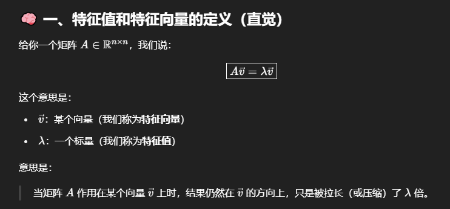
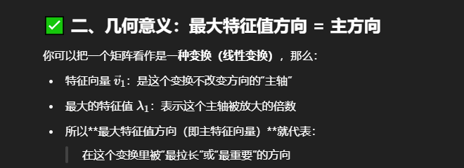

## 矩阵的特征值和特征向量

一个任意的向量 x 通常不是特征向量。当它被矩阵 A 变换后，它的方向和长度都会改变。

但是，我们可以把这个任意向量 x 分解到各个特征向量所构成的“坐标系”中去。（为了简化，我们假设矩阵 A 有足够的线性无关的特征向量来张成整个空间，这对于对称矩阵总是成立的）。

假设我们有一个 2x2 的矩阵 A，它有两个特征向量 v₁ 和 v₂，对应的特征值是 λ₁ 和 λ₂。并且我们假设 |λ₁| > |λ₂|（λ₁ 的绝对值更大）。

那么，任何一个二维向量 x 都可以表示为：
x = c₁v₁ + c₂v₂
(其中 c₁ 和 c₂ 是系数，表示 x 在 v₁ 和 v₂ 方向上的“分量”)

第三步：对这个任意向量 x 进行变换
现在我们用矩阵 A 去变换 x：
**Ax = A(c₁v₁ + c₂v₂)**
根据线性变换的性质，可以展开：
**Ax = c₁(Av₁) + c₂(Av₂)**
现在，关键的一步来了！我们把 Av₁ = λ₁v₁ 和 Av₂ = λ₂v₂ 代入：
**Ax = c₁(λ₁v₁) + c₂(λ₂v₂)**
**Ax = (c₁λ₁)v₁ + (c₂λ₂)v₂**

第四步：观察结果，理解“最拉长”
比较一下变换前后的向量：
变换前: x = c₁v₁ + c₂v₂
变换后: Ax = (c₁λ₁)v₁ + (c₂λ₂)v₂
发生了什么？
向量 x 在 v₁ 方向上的分量，从 c₁ 被放大到了 c₁λ₁。
向量 x 在 v₂ 方向上的分量，从 c₂ 被放大到了 c₂λ₂。
因为我们假设了 |λ₁| > |λ₂|，这意味着 v₁ 方向上的分量被拉伸得更狠！

结论：
一个随机的向量 x，在经过变换 A 之后，其结果 Ax 的方向会更加偏向于那个具有最大特征值（绝对值最大）的特征向量的方向。因为那个方向的“拉伸”效应最强，它在最终的结果中占据了主导地位。

## 奇异值

## 矩阵的范数、秩