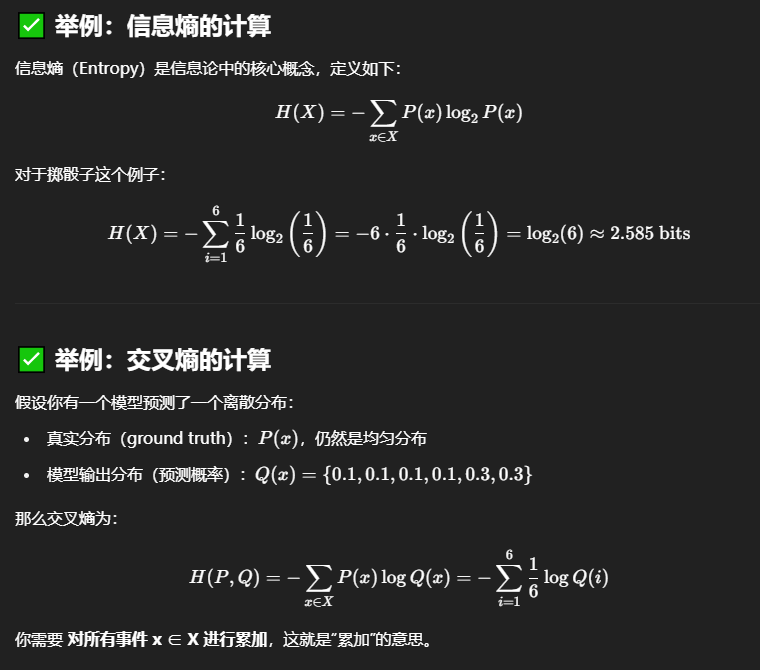

nn.CrossEntropyLoss (交叉熵损失)
nn.CrossEntropyLoss 是分类任务中最常用的损失函数之一，尤其适用于多类别分类。它结合了 LogSoftmax 和 NLLLoss（负对数似然损失）的功能。这意味着你的模型不需要在输出层手动添加 nn.LogSoftmax 或 nn.Softmax，nn.CrossEntropyLoss 会自动处理。
特点：
• 输入:
• input (模型输出): 通常是模型最后一层的原始预测值（logits），形状为 (batch_size, num_classes)。注意，这些不是概率值，也不需要经过 Softmax。
• target (真实标签): 包含每个样本的类别索引，形状为 (batch_size)。对于每个样本，值应在 0 到 num_classes - 1 之间。
• 计算: 对于每个样本，它首先对模型的输出应用 Softmax 函数，将其转换为概率分布，然后计算真实标签对应概率的负对数。
• 用途: 主要用于多类别分类问题。

| 情境                    | 用途          |
| --------------------- | ----------- |
| 信息熵 $H(X)$            | 衡量系统不确定性    |
| 交叉熵 $H(P, Q)$         | 衡量预测与真实分布差异 |
| 多分类任务 $H(P, Q)$  | 特殊的交叉熵，P只有一个维度为1,其余为0   |
