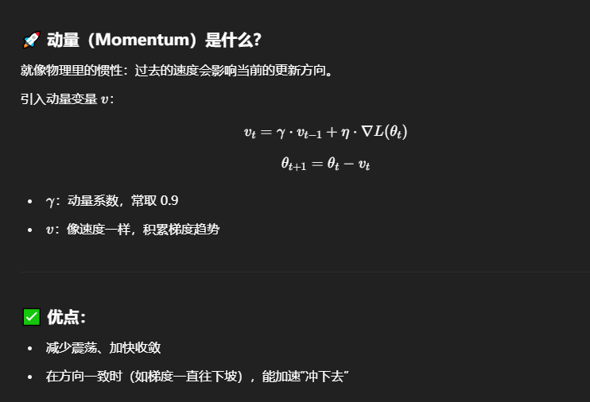
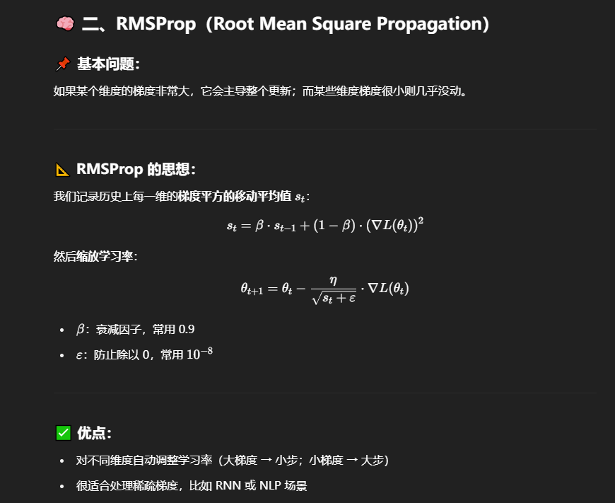

| 优化器              | 公式 / 原理简介                                                                 |
| ---------------- | ------------------------------------------------------------------------- |
| `SGD`            | 最基础的梯度下降法：每次更新只靠当前梯度： $\theta = \theta - \eta \cdot \nabla L(\theta)$  |
| `SGD + momentum` | 加入动量项： $v = \gamma v + \eta \nabla L(\theta)$ $\theta = \theta - v$ |
| `Adam`           | 自适应梯度优化算法，结合了 Momentum + RMSProp： 根据历史梯度的一阶和二阶矩估计自动调整学习率               |

Adam = SGD + momentum + RMSProp

# Momentum:

# RMSProp

| 名称       | 类比       | 说明              |
| -------- | -------- | --------------- |
| Momentum | 小球加速下滑   | 记录历史方向更稳        |
| RMSProp  | 自适应避开大陡坡 | 按维度调整学习率        |
| Adam     | 又会冲又会躲   | 速度 + 自调节，一体化优化器 |
