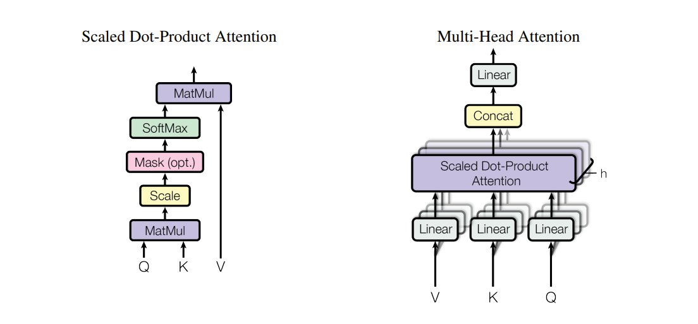

### 1. **缩放点积注意力（Scaled Dot-Product Attention）**
单头注意力的计算方式：
\[
\text{Attention}(Q, K, V) = \text{softmax}\left(\frac{QK^T}{\sqrt{d_k}}\right)V
\]
- \( Q \)（Query）、\( K \)（Key）、\( V \)（Value）是输入矩阵。
- \( d_k \) 是Key的维度，缩放因子 \(\sqrt{d_k}\) 用于防止点积过大导致梯度消失。

---

### 2. **多头注意力（Multi-Head Attention）**
将Query、Key、Value通过不同的线性投影拆分成 \( h \) 个头，独立计算注意力后拼接：
\[
\text{MultiHead}(Q, K, V) = \text{Concat}(\text{head}_1, \ldots, \text{head}_h)W^O
\]
其中每个头的计算为：
\[
\text{head}_i = \text{Attention}(QW_i^Q, KW_i^K, VW_i^V)
\]
- \( W_i^Q \in \mathbb{R}^{d_{\text{model}} \times d_k} \), \( W_i^K \in \mathbb{R}^{d_{\text{model}} \times d_k} \), \( W_i^V \in \mathbb{R}^{d_{\text{model}} \times d_v} \) 是第 \( i \) 个头的投影矩阵。
- \( W^O \in \mathbb{R}^{hd_v \times d_{\text{model}}} \) 是输出投影矩阵。
- 论文中默认 \( h=8 \) 个头，且 \( d_k = d_v = d_{\text{model}}/h = 64 \)（当 \( d_{\text{model}}=512 \) 时）。

---

多头注意力能让模型从多个子空间、多个角度并行地关注输入序列的不同部分，
捕捉更丰富、更细致的语义和结构信息。

---

## 多头注意力机制的**完整计算流程**


## 🧠 基础设置：

| 参数名                | 含义               | 示例数值                   |
| ------------------ | ---------------- | ---------------------- |
| $B$                | Batch size       | 32                     |
| $T$                | 序列长度（token数）     | 20                     |
| $d_{\text{model}}$ | 模型维度             | 512                    |
| $h$                | 头的数量（num\_heads） | 8                      |
| $d_k = d_v$        | 每个头的维度           | 64 （因为 $512 / 8 = 64$） |

---

## ✅ Step 1：输入

$$
X \in \mathbb{R}^{B \times T \times d_{\text{model}}}
$$

* X 是每个 token 的 embedding 或上层输出。

---

## ✅ Step 2：线性变换得到 Q, K, V

使用统一的线性层得到 3 个矩阵：

$$
Q = XW^Q,\quad K = XW^K,\quad V = XW^V
$$

权重矩阵形状：

* $W^Q, W^K, W^V \in \mathbb{R}^{d_{\text{model}} \times d_{\text{model}}}$

因此输出形状：

$$
Q, K, V \in \mathbb{R}^{B \times T \times d_{\text{model}}}
$$

---

## ✅ Step 3：reshape 拆成多个头

我们将 Q/K/V reshape 成多个 attention 头：

```python
Q → [B, T, h, d_k] → [B, h, T, d_k]
```

所以：

$$
Q, K, V \in \mathbb{R}^{B \times h \times T \times d_k}
$$

说明：

* 第一个维度是 batch
* 第二个维度是头数
* 每个头有自己的一份 Q/K/V，维度是 $T \times d_k$

---

## ✅ Step 4：Scaled Dot-Product Attention（每个头）

对每个头进行注意力计算：

$$
\text{Attention}(Q_i, K_i, V_i) = \text{softmax}\left( \frac{Q_i K_i^\top}{\sqrt{d_k}} \right) V_i
$$

我们对所有头并行做：

$$
\text{scores} = \frac{Q K^\top}{\sqrt{d_k}} \quad \text{shape: } [B, h, T, T]
$$

$$
\text{weights} = \text{softmax(scores)} \quad \text{shape: } [B, h, T, T]
$$

$$
\text{output\_per\_head} = \text{weights} \cdot V \quad \text{shape: } [B, h, T, d_k]
$$

---

## ✅ Step 5：拼接多个头

将所有头拼接回一个大张量：

```python
concat = output_per_head.transpose(1, 2).reshape(B, T, h * d_k)
```

$$
\text{Concat}(\text{head}_1, \dots, \text{head}_h) \in \mathbb{R}^{B \times T \times d_{\text{model}}}
$$

因为：

$$
h \cdot d_k = d_{\text{model}}
$$

---

## ✅ Step 6：输出投影

再做一次线性变换得到最终输出：

$$
\text{MHA}(X) = \text{Concat}(\text{heads}) \cdot W^O
$$

其中：

* $W^O \in \mathbb{R}^{d_{\text{model}} \times d_{\text{model}}}$
* 输出形状：

  $$
  \boxed{\text{Output} \in \mathbb{R}^{B \times T \times d_{\text{model}}}}
  $$

---

## ✅ 总体流程图（带形状）

```text
Input:
  X ∈ [B, T, d_model]

↓ Linear: Q = XW^Q, K = XW^K, V = XW^V
  Q, K, V ∈ [B, T, d_model]

↓ Reshape + Transpose
  Q, K, V ∈ [B, h, T, d_k]

↓ Scaled Dot-Product Attention (每个头)
  Attention weights: [B, h, T, T]
  Head outputs:      [B, h, T, d_k]

↓ Concatenate all heads
  [B, T, h*d_k] = [B, T, d_model]

↓ Linear projection W^O
  Output ∈ [B, T, d_model]
```

---

## ✅ 小结所有关键变量和形状：

| 名称                | 含义                   | 形状                                         |
| ----------------- | -------------------- | ------------------------------------------ |
| X                 | 输入序列                 | $B \times T \times d_{\text{model}}$       |
| W^Q/K/V           | Q/K/V 权重矩阵           | $d_{\text{model}} \times d_{\text{model}}$ |
| Q/K/V             | query/key/value      | $B \times T \times d_{\text{model}}$       |
| 分头后的 Q/K/V        | 多头 attention 输入      | $B \times h \times T \times d_k$           |
| attention weights | softmax(QKᵀ / √d\_k) | $B \times h \times T \times T$             |
| head\_i           | 每个头的注意力输出            | $B \times h \times T \times d_k$           |
| concat            | 所有头拼接结果              | $B \times T \times d_{\text{model}}$       |
| W^O               | 输出投影矩阵               | $d_{\text{model}} \times d_{\text{model}}$ |
| Output            | 最终 MHA 输出            | $B \times T \times d_{\text{model}}$       |

---

