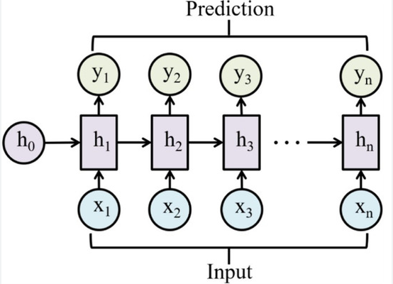
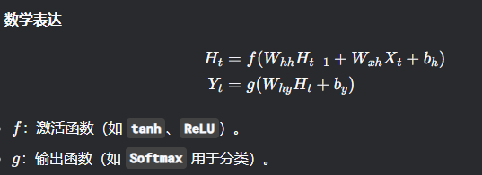

目标：
    学习循环神经网络（RNN）的基本结构及其处理序列数据的方式。
    理解 RNN 的长期依赖问题（梯度消失/爆炸）。

### 循环神经网络（RNN）的基本结构及其处理序列数据的方式
循环神经网络（RNN）是一类专门设计用于处理序列数据的神经网络。与传统神经网络（如多层感知机）处理固定大小的独立输入不同，RNN 能够处理长度可变的序列，并且在处理当前元素时，会考虑序列中之前元素的信息。

### 为什么需要 RNN？
考虑以下场景：

- 文本翻译：将一句中文翻译成英文，句子的意思取决于每个词的顺序和上下文。

- 语音识别：理解一段语音，每个音素的含义都可能受到前后音素的影响。

- 股票预测：预测明天的股价，需要考虑过去几天的股价走势。

这些任务的共同特点是输入数据具有时间依赖性或序列性。传统神经网络无法有效捕捉这种依赖关系，因为它们假设输入是相互独立的。RNN 通过引入“循环”结构来解决这个问题。

### 结构

### 长期依赖问题
梯度消失（Vanishing Gradients）
梯度消失是 RNN 长期依赖问题中最常见且更严重的形式。
1. 理解梯度的传播
在 RNN 的反向传播过程中，梯度会沿着时间步倒序传播。这意味着要计算当前时间步的损失对早期时间步的参数的梯度，需要将梯度链式地乘上许多权重矩阵（尤其是 ）。
2. 梯度的“萎缩”
想象一下一个数学过程：你有一个小于 1 的小数（例如 0.5），你不断地将它乘以自己：结果会迅速趋近于 0。
在 RNN 中，如果连接隐藏状态的权重矩阵  的值较小（或者其奇异值/特征值小于 1），那么在梯度反向传播时，每经过一个时间步，梯度就会被这个  乘以一次。当序列很长时，梯度会变得非常非常小，以至于对早期时间步的参数更新几乎没有影响。
1. 导致的问题
• 无法学习长距离依赖: 由于早期时间步的梯度信息变得微弱，模型在训练时无法有效地调整这些早期参数，从而无法捕捉到序列中相隔较远的信息之间的关联。
• “短期记忆”: RNN 倾向于只记住最近的信息，而忘记了很久以前的信息。这使得它们在处理长文本、长语音序列等任务时效果不佳。

梯度爆炸（Exploding Gradients）
梯度爆炸与梯度消失相反，虽然不如梯度消失常见，但同样有害。
1. 梯度的“膨胀”
如果权重矩阵  的值较大（或者其奇异值/特征值大于 1），那么在梯度反向传播时，每经过一个时间步，梯度就会被这个  乘以一次。当序列很长时，梯度会呈指数级增长，变得异常巨大。
2. 导致的问题
• 模型不稳定: 巨大的梯度会导致参数更新的步长过大，使得模型参数在训练过程中“跳来跳去”，无法收敛到最优解。
• NaN 值: 权重更新可能会变得非常大，导致模型参数溢出，变成 NaN (Not a Number)。
3. 缓解方法
与梯度消失不同，梯度爆炸相对容易检测和处理。最常用的方法是梯度裁剪（Gradient Clipping）：
• 在反向传播计算出梯度之后，但在优化器更新参数之前，将梯度的范数（norm）限制在一个预设的最大值以内。如果梯度的范数超过这个阈值，就按比例缩小它。

